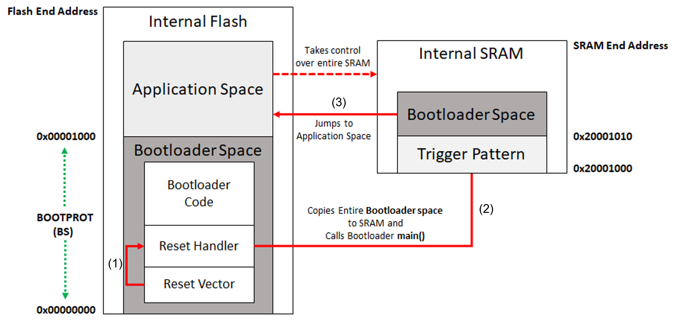
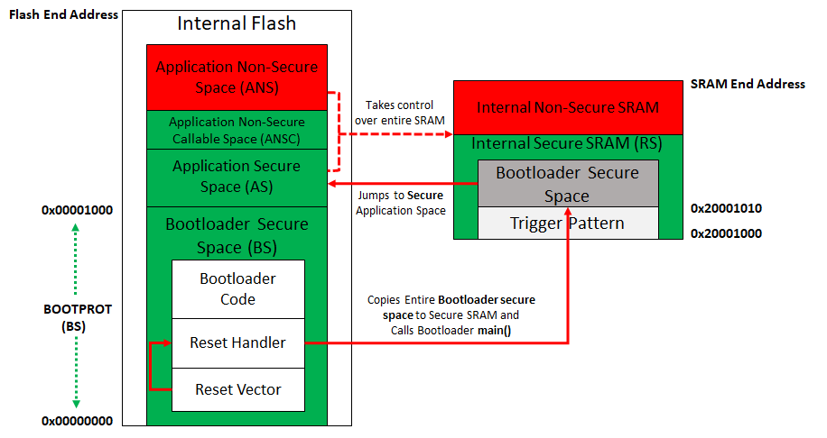

To clone or download this application from Github,go to the [main page of this repository](https://github.com/Microchip-MPLAB-Harmony/bootloader_apps_pic32cm_le_ls) and then click Clone button to clone this repo or download as zip file. This content can also be download using content manager by following [these instructions](https://github.com/Microchip-MPLAB-Harmony/contentmanager/wiki)

# UART-I2C Factory Programed Bootloader

The Bootloader programmed at production by Microchip is an MPLAB Harmony v3 based Bootloader capable of programming an application binary using either the UART or I2C interface.

### Bootloader Application

Key Features
- The Bootloader is programmed at the Flash memory location (0x0000-0000) and takes up to 4KB of Flash memory. It is protected by default using the SULCK and BOOTPROT fuse settings from any erase-writes. The BOOTPROT value is set to 4KB (0x1000).
- The Bootloader startup code copies the Bootloader from the Flash memory to the SRAM from (0x2000-1010) before calling the main function. The main function (and therefore the entire Bootloader) runs from the SRAM to allow upgrading of the Bootloader code itself in Flash memory. Bootloader code will unlock the BOOTPROT region before updating if bootloader region has to be programmed.
- The Bootloader provides a feature to read the current version of the Bootloader running by using the read version command
- The Bootloader provides a feature to program the Fuse settings using a separate command
- The Bootloader will provide two ways to trigger the Bootloader mode:

    External trigger: Bootloader will be triggered based on the status of a GPIO pin
    
    Internal trigger: Bootloader will be triggered based on the trigger pattern written at a specific location in SRAM by the application firmware
    
- After a new application image is programmed, the Bootloader will verify the programmed application space by generating a CRC-32 value and comparing it with the CRC-32 received from the host. The application CRC will not be verified after every reset before jumping to the application space for faster startup.
- The Bootloader will read the first four bytes of application space (0x1000) to decide if a valid application is present. If the contents of the first four bytes are not 0xFFFF-FFFF, then the Bootloader assumes a valid application is present and jumps to the application. If a valid application is not present, then the Bootloader will wait, and remain in Bootloader mode.

Key Features for TrustZone variants PIC32CM LS00/LS60

- Bootloader is part of the Secure Flash BOOTPROT region with no BNSC region
- The Bootloader will always jump to Application Secure Region at location 0x1000 after programming. Hence, the applications Reset handler should be part of Application Secure Region which can further call its Non-Secure region if any.

Key Requirements

- By default the Bootloader expects the application to start from the 0x1000 location. Therefore, the application should be built to start from the 0x1000 Flash location.
- For trustZone variants, proper fuse settings required by the application have to be sent along with application binary
- External Pull-ups need to be used for the I2C SDA and SCL lines

#### UART-I2C Bootloader Memory Layout For PIC32CM LE00

#### UART-I2C Bootloader Memory Layout For PIC32CM LS00/LS60

#### UART-I2C Bootloader System Level Execution Flow

#### UART, I2C and Boot Pin Configurations

| Protocol  | Port Pin Configuration                                     | SERCOM Instance  |
| ----------|:-----------------------------------------------------------| -----------------|
| UART      | PB02 - TX - SERCOM5/PAD0                                   |     SERCOM 5     |
|           | PB03 - RX - SERCOM5/PAD1                                   | (Can be accessed only in Secure region)                 |
| I2C       | PA22 - SDA - SERCOM2/PAD0 - External Pull-up required      |     SERCOM 2     |
|           | PA23 - SCL - SERCOM2/PAD1 - External Pull-up required      | (Can be accessed only in Secure region)                 |
| Boot pin  | PB08 - GPIO - Input - Pull-up enabled                      |         -        |
|           | (Can be accessed only in Secure region)                    |         -        |

#### UART and I2C communication configurations

| Protocol  | Communication Parameters                                   |
| ----------|:-----------------------------------------------------------|
| UART      | 115200 baud, 8-bit, Even parity, 1 Stop bit                |
| I2C       | Up to 400 kHz speed.                                       |
|           | I2C client 7-bit address (0x40) - 1000-000x (where x = 0 for write, 1 for read). |
|           | Address is fixed and not programmable through any hardware setting.      |

### Bootloader Entry Mechanisms
#### Default Entry Mechanism:

- The Bootloader will run automatically if there is no valid application firmware. Firmware is considered valid if the first word at the application start address is not 0xFFFFFFFF.
- Normally this word contains the initial stack pointer value, so it will never be 0xFFFFFFFF unless device is erased

#### Trigger Entry Mechanism:

- External trigger:

  – The Boot pin should be used to trigger the Bootloader after reset (See the following table)

  – Drive the respective Boot pin to a low state, then reset the device. Upon reset, the Bootloader runs and checks the status of the Boot pin. If the status of the pin is low, the Bootloader enters the firmware upgrade mode.

- Bootloader Trigger Pattern in SRAM:

  – The application can trigger the Bootloader by writing a Bootloader trigger pattern of length four words (1 word = 4 bytes) to SRAM location 0x20001000, then resetting the device. Bootloader will not be using the initial 4KB of SRAM as it will be cleared by BOOTROM at reset. Hence the bootloader trigger pattern has to be stored at 0x20001000 of SRAM

  – Upon reset, the Bootloader runs and checks the first four words of the SRAM location 0x20001000 for the presence of the Bootloader trigger pattern. If found, the Bootloader enters the firmware upgrade mode.

  – To invoke the Bootloader, the trigger pattern is 0x5048434D

| Trigger mode          | Trigger method                                                                    |
| ----------------------|-----------------------------------------------------------------------------------|
| Boot pin              | PB08 = Active low                                                                 |
|                       | (Internal pull-up is enabled. No hardware/software de-bouncing is implemented.)   |
| SRAM trigger pattern  | SRAM Word[0] = 0x5048434D                                                         |
| (0x20001000)          | SRAM Word[1] = 0x5048434D                                                         |
|                       | SRAM Word[2] = 0x5048434D                                                         |
|                       | SRAM Word[3] = 0x5048434D                                                         |

### Fuse Configurations
- The Bootloader has the Fuse settings set to default except below fuse bits

  Bootloader region size (4096 Bytes) is specified using BOOTPROT fuse bit. BOOTPROT = 0x10

  Bootloader region is protected by setting the SULCK fuse configuration at production to 0x6 (SULCK.BS = 0)
  
- The Fuse settings can be changed in following ways:

  The Bootloader provides a separate command to program the Fuse Bits received from the host. Refer to the Bootloader protocol documentation and respective host utility documentation for more information.

  The application can check the Fuse bits during the boot-up and then program any change required using the NVMCTRL peripheral
  
- As fuse settings are placed in a higher memory location in the Flash (User Row and BOCOR Row), the Fuse settings need to be disabled for the application project, which will be boot-loaded since the size of the binary file becomes too large when the fuse settings are enabled

- When updating the Bootloader itself, make sure that the fuse settings for the Bootloader application are also disabled

#### For PIC32CM LS00/LS60
– Proper fuse settings required by the application have to be sent along with application binary.

– Peripherals used by Bootloader (SERCOM5, SERCOM2, BOOT Pin) should not be configured as Non-Secure while updating the Fuse settings

– When WDT is enabled from Fuse Settings bootloader refreshes WDT at intervals to avoid reset. Hence, WDT peripheral should not be configured as Non-Secure if it is enabled via Fuse settings.

### UART Host Tool
A python host utility is provided as part of the MPLAB Harmony v3 Bootloader package which can be used to communicate with the Bootloader to send a binary over the UART from the Host PC.

Refer to [UART Bootloader Host Script Help](https://microchip-mplab-harmony.github.io/bootloader/?GUID-8BE0388C-8563-4ED8-9C17-F3FE7B88FE51) for more details on usage of the host utility.

### I2C Embedded Host
The MPLAB Harmony v3 based I2C embedded host application is provided as a reference which sends a binary over the I2C from a host microcontroller.
Refer to the [I2C Host App SD-Card application](docs/i2c_sdcard_host_app.md) for more details.

### Other References
- Refer to the [Bootloader Library](https://microchip-mplab-harmony.github.io/bootloader/) for understanding:

  Bootloader framework
  
  How the Bootloader library works
  
  Bootloader library configurations
  
  Bootloader memory layout
  
- Refer to the [UART Bootloader Protocol](https://microchip-mplab-harmony.github.io/bootloader/?GUID-8828D474-F227-4FE0-88EE-135AA591750F) for understanding:

  Details on protocol
  
  Various commands supported
  
- Refer to the [I2C Bootloader Protocol](https://microchip-mplab-harmony.github.io/bootloader/?GUID-3942704D-13D2-4E8E-A9DC-4055E7F6D5AB) for understanding:

  Details on protocol
  
  Various commands supported
